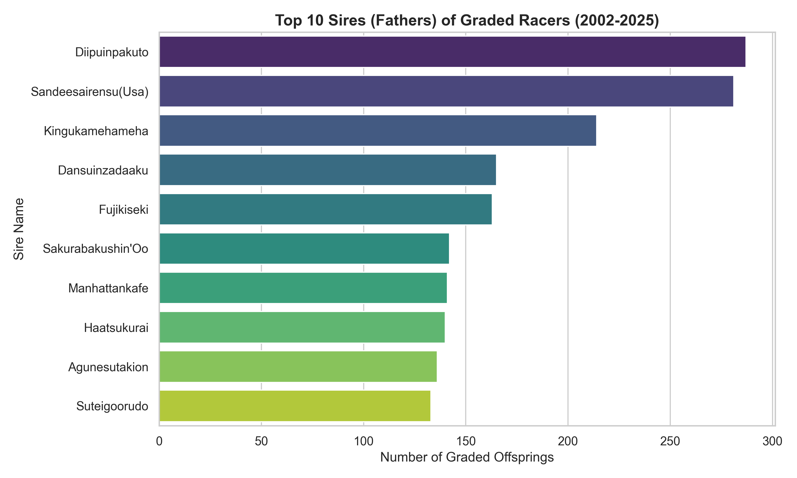
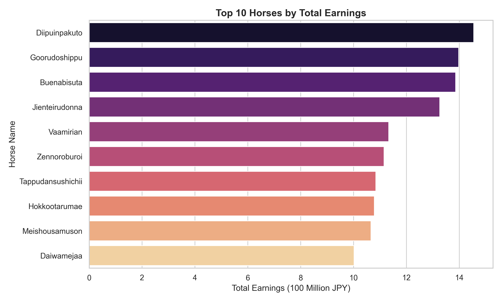

# 🏇 JRA Graded Races & JBIS Pedigree Analysis (AEDS 2)

<div align="center">
  <a href="README.md">🇧🇷 Português</a> |
  <a href="README.en.md">🇺🇸 English</a> |
  <a href="README.ja.md">🇯🇵 日本語</a>
</div>

<br/>

<div align="center">
  
  
  
  
  <a href="https://github.com/ImArthz/AEDS2_jra_analysis/actions/workflows/compile_latex.yml">
    
  </a>
</div>

<br/>

Este repositório consolida o projeto final desenvolvido para a disciplina de **Algoritmos e Estruturas de Dados 2 (AEDS 2)**. Trata-se de um robusto ecossistema de engenharia de dados focado no turfe japonês moderno. O sistema extrai e estrutura resultados históricos das corridas de elite da **Japan Racing Association (JRA)** e cruza esses dados com a enciclopédia genética do **Japan Bloodhorse Information System (JBIS)**, modelando o resultado final em algoritmos complexos de **Teoria dos Grafos**.

---

## 🎯 Objetivos do Projeto

- **Escalabilidade & Web Scraping:** Processar milhares de resultados históricos contornando instabilidades e mudanças de layout ao longo de 20 anos (2002 a 2025).
- **Integridade Relacional:** Manter um banco de dados estruturado protegendo a integridade referencial via restrições rigorosas (`FOREIGN KEY`, `ON UPDATE CASCADE`).
- **Análise com Grafos:** Mapear redes biológicas (Árvores Genealógicas) e esportivas (Competidores) usando algoritmos avançados (como PageRank e Centralidade) para descobrir as linhagens mais influentes.

---

## 🏗 Arquitetura do Pipeline

O núcleo do projeto opera por meio de um Pipeline autônomo dividido em 5 etapas principais:

### 1. JRA Scraper (Extração Graded)
Vasculha o histórico de corridas japonesas do tipo G1, G2 e G3, extraindo métricas precisas (idade, tempo, margem de vitória, variação de peso na pista e condições climáticas). Para otimização, o sistema possui **Skip Logic** e ignora automaticamente provas já integradas ao banco.

### 2. JBIS Scraper (Pedigree & Perfil Biológico)
Busca dados sobre ganhos financeiros (em Ienes) na página dos perfis, além de minerar e modelar uma **Árvore Genealógica de 5 Gerações** (até 62 ancestrais por cavalo) que fundamenta as análises genéticas e de endocruzamento.

### 3. Sistema de Validação Dinâmica (QA)
Gera relatórios de integridade referencial automáticos e dispara alertas em caso de anomalias nas relações entre Tabelas de Cavalo e Resultados.

### 4. Dicionário de Tradução Dinâmica (JP -> EN)
Módulo que converte dinamicamente terminologias de pista (`良` -> `Firm`) e clima do formato codificado japonês para a taxonomia esportiva universal em Inglês. Essencial para treinar futuros algoritmos de Inteligência Artificial sem viés de idioma.

### 5. Engine Analítica de Grafos
- **Grafos Direcionados Acíclicos (DAG):** Mapeamento genético focado na árvore ascendente dos animais (útil para Lowest Common Ancestor).
- **Grafos Bipartidos e de Centralidade:** Conexão direta entre jóqueis e cavalos. Utilização do algoritmo **PageRank** da Google adaptado para o ecossistema das corridas.

---

## 📊 Estrutura de Dados & Relatórios
Todo o projeto foi espelhado dinamicamente entre arquivos `.csv` estáticos na pasta `data/csv/` e um banco SQLite `jra_graded.db`.

📄 **Relatório Técnico Completo:**
Elaborei um documento minucioso explicando minha arquitetura, os erros que contornei (como blocos de IP e restrições silenciosas do banco) no formato `LaTeX`.

<table>
  <tr>
    <td align="center">
      <a href="https://github.com/ImArthz/AEDS2_jra_analysis/releases/latest/download/relatorio_extracao.pdf">
        
      </a>
    </td>
    <td align="center">
      <a href="https://github.com/ImArthz/AEDS2_jra_analysis/releases/latest/download/relatorio_extracao_en.pdf">
        
      </a>
    </td>
    <td align="center">
      <a href="https://github.com/ImArthz/AEDS2_jra_analysis/releases/latest/download/relatorio_extracao_ja.pdf">
        
      </a>
    </td>
  </tr>
</table>

Os arquivos renderizados acima são compilados automaticamente via **GitHub Actions** a cada push.

---

## 🚀 Como Iniciar

1. Clone o repositório na sua máquina local.
2. Dê um duplo clique no arquivo facilitador **`run_full.bat`** no Windows, ou execute:
   ```bash
   cd src
   python run_pipeline.py --start-year 2002 --end-year 2025 --analyze
   ```

## 📊 Insights dos Dados

Durante o sprint de extracao de 36 horas, consolidamos um banco de dados biologico massivo. Aqui estao alguns insights visuais gerados diretamente dos CSVs em ingles:

### Top 10 Sires (Pais)
Um olhar sobre as linhagens (bloodlines) mais dominantes nas corridas Graded do Japao (2002-2025).


### Top 10 Cavalos Mais Ricos
Os cavalos com os maiores ganhos totais registrados no banco de dados.

